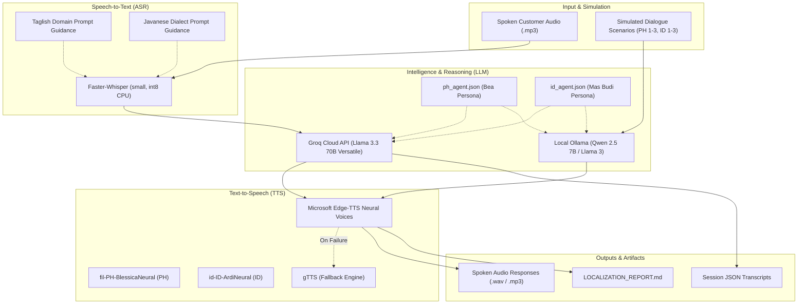

### 1. What This App Does

This app is a **Localized Voice AI Prototype Suite** designed specifically for financial services in Southeast Asia—targeting the **Philippines (Bancassurance & Life Insurance)** and **Indonesia (Multifinance & Consumer Credit)**.

Its primary purpose is to solve the critical failure of generic voice bots in Southeast Asia, where direct machine translation causes immediate customer hang-ups due to stiff phrasing, missing respect markers, and incorrect financial terminology.

#### Core Capabilities:

1. **Multi-Turn Call Simulation Engine (`simulate_voice_calls.py`)**:
   * Simulates full, two-way automated phone calls between AI voice agents and realistic customer personas across **6 scenarios**:
     * **🇵🇭 PH Call 01 (Cooperative)**: Lead qualification in Taglish with daily coffee price framing (₱2,000/mo) and branch advisor referral.
     * **🇵🇭 PH Call 02 (Objection & Escalation)**: Handling an upset customer disputing premium rider charges with human agent transfer.
     * **🇵🇭 PH Call 03 (Grace Period & Lapse)**: Managing a failed auto-debit on an expired card and reassuring the customer about the 31-day grace period.
     * **🇮🇩 ID Call 01 (Cooperative)**: Friendly motorcycle installment (*angsuran*) reminder with instant BCA Virtual Account payment.
     * **🇮🇩 ID Call 02 (Javanese Dialect Dispute)**: Handling a farmer disputing a late fee (*denda*) due to delayed harvests using Javanese-influenced Bahasa Indonesia (*nggih, sampeyan*).
     * **🇮🇩 ID Call 03 (Hardship & Janji Bayar)**: Negotiating an overdue car payment with a small business owner, preventing SLIK OJK credit score damage, and securing a payment commitment date.
   * Generates text transcripts (`*_transcript.txt`) and spoken call audio recordings (`*.mp3`).

2. **End-to-End Live Voice Agent Runtime (`ASR_Engines.py`)**:
   * A full speech processing pipeline:
     $$\text{Customer Spoken Audio} \xrightarrow{\text{Faster-Whisper ASR}} \text{Transcript} \xrightarrow{\text{Groq Llama 3}} \text{Localized Reply} \xrightarrow{\text{Edge-TTS}} \text{Spoken Voice}$$
   * Logs structured session metadata and conversation history to JSON in `transcripts/`.

3. **Declarative Agent Specification Layer (`ph_agent.json` & `id_agent.json`)**:
   * Decouples prompt engineering and business rules from the execution code.
   * Enforces conversational registers (natural **Taglish** with *po*/*ho* for PH; **Santai tapi Santun** with *Mas/Mbak/Pak/Bu* for ID).
   * Defines domain FAQs, currency conventions (₱ vs Rp), payment channels (GCash/Maya vs Virtual Accounts), and fallback guardrails (preventing the AI from accidentally switching to English).

---

### 2. Tech Stack Architecture

---

### 3. Libraries & Dependencies Used

| Category | Library | Version / Model | Exact Role in the Application |
| :--- | :--- | :--- | :--- |
| **Speech-to-Text (ASR)** | **`faster-whisper`** | `small` (int8 quantized) | Transcribes input audio files locally on CPU using CTranslate2; conditioned with market-specific language tags (`tl` / `id`) and vocabulary prompts. |
| **LLM Inference (Cloud)** | **`groq`** | `llama-3.3-70b-versatile` | Ultra-fast cloud inference for real-time conversational voice responses via `AsyncGroq`. |
| **LLM Inference (Local)** | **`ollama`** | `qwen2.5:7b` (or `llama3.1`) | Local open-source model execution for multi-turn simulated dialogues between agent and customer personas. |
| **Text-to-Speech (Neural)**| **`edge-tts`** | Microsoft Azure Neural | Synthesizes spoken audio using regional neural voices: `fil-PH-BlessicaNeural` (Female Taglish) and `id-ID-ArdiNeural` (Male Indonesian). |
| **Text-to-Speech (Fallback)**| **`gTTS`** | Google Translate TTS | Lightweight secondary fallback TTS engine for offline or low-overhead audio generation. |
| **Concurrency & Async** | **`asyncio`** | Python Built-in | Manages non-blocking pipeline execution (Groq API requests, Edge-TTS streaming, and ASR callbacks). |
| **Data & Specifications** | **`json`** | Python Built-in | Parses declarative agent configuration schemas (`id_agent.json`, `ph_agent.json`) and serializes session transcripts. |
| **CLI & Environment** | **`argparse`**, **`os`**, **`sys`** | Python Built-in | Handles market filtering (`--market PH\|ID\|ALL`), pipeline evaluation flags (`--asr`, `--report`), and environment keys. |
| **Timestamps & Logging** | **`datetime`** | Python Built-in | Generates ISO-8601 timestamps for session tracking and transcript auditing. |
